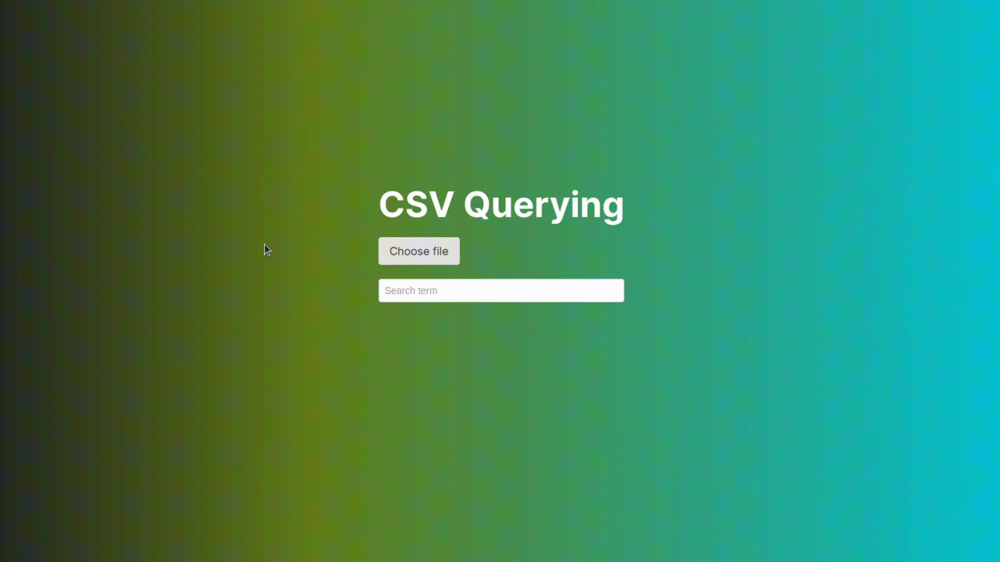

# CSV-Querying
With this app you can upload a file then search terms in the document.  
  

## How to run it
### Back-end
- `cd back-end`
- `npm install`
- `npm run dev`

### Front-end
- `cd front-end`
- `npm install`
- `npm run dev`

### Tests
- `cd back-end`
- `npm run test`

## Considerations
- The `.env` files were intentionaly filled and sent to remote repository for practical project execution purpose
- The app needs the ports `3000` and `3333` to be available
- The database is SQLite
- There is an error handling in the front-end for uploading a file that is not CSV
- The app has mobile responsivity